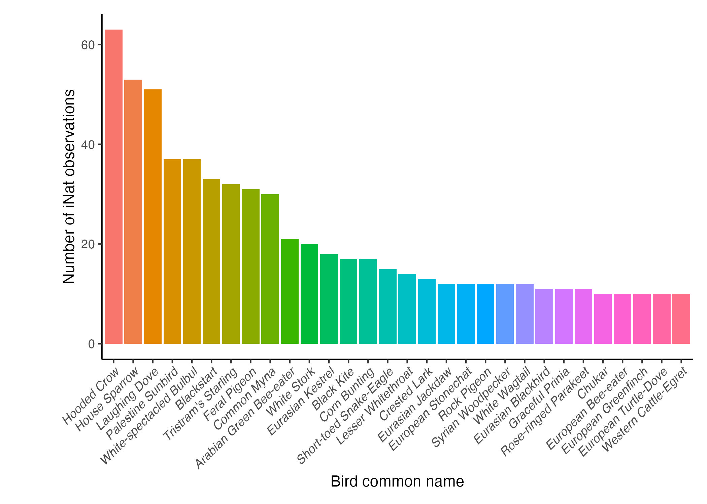

# birds_of_palestine
All iNaturalist observations of birds in Palestine in the last year. An exported CSV of all iNaturalist observations in "observations-465502.csv" were generated 
with this query: `has%5B%5D=photos&quality_grade=any&identifications=any&iconic_taxa%5B%5D=Aves&place_id=9753&verifiable=true&d1=2023-08-01&d2=2024-08-01&spam=false` or [this search](https://inaturalist.ca/observations?d1=2023-10-07&d2=2024-08-01&place_id=9753&subview=map&iconic_taxa=Aves).   
Here's a quick plot, generated by `bin/temp.R` of bird species observed more than 10 times:  
  
